# Web Analytics -- Traffic Acquisition Report

**Date range:** 2017-05-17 to 2019-08-31
**Generated:** 2026-03-07
**Data source:** data/analytics.csv

---

## Executive Summary

- **Organic Search** is the dominant acquisition channel, accounting for 37.2% of all sessions (143,580 sessions).
- The website received a total of **385,923 sessions** and **832,710 pageviews** between 2017-05-17 and 2019-08-31.
- **United States** is the largest market with 114,891 sessions.
- Mobile traffic represents **25.6%** of sessions and is stable over the analysis period.
- The top source/medium is **google.com.br / Referral** (138,090 sessions) -- flagged as a potential GA tagging anomaly (see Source/Medium section).

---

## Data Overview

| Metric | Value |
| --- | --- |
| Original raw rows | 259,115 |
| Duplicate rows removed | 10,807 |
| Dirty rows removed (pageviews = 0) | 18 |
| Final clean rows | 248,290 |
| Date range | 2017-05-17 to 2019-08-31 |
| Unique countries | 189 |
| Unique pages | 1844 |
| Unique source/medium combinations | 262 |

**Data quality notes:**

- The source file uses a non-standard UTF-16 LE encoding with a 2-byte non-BOM prefix (`0xB8 0xC0`). Standard CSV readers fail; the file requires binary loading with a 2-byte skip before decoding as `utf-16-le`.
- 141,017 rows have `Sessions = 0` (pageview-only hits). These are retained for pageview and page-level metrics but excluded from all session-count and bounce-rate calculations.
- 86 rows have an average page load time exceeding 10,000 ms -- likely Google Analytics aggregation artefacts. They are flagged (`page_load_outlier = True`) and excluded from load time medians but retained in the dataset.

---

## Traffic Trends

The chart below shows monthly sessions and pageviews across the full analysis window.

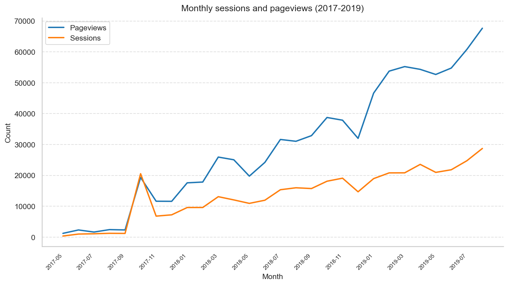

Traffic grew substantially between 2017 and 2018, with the highest session volumes recorded in 2018 and 2019. Pageviews track sessions closely, suggesting a relatively stable pages-per-session ratio over time.

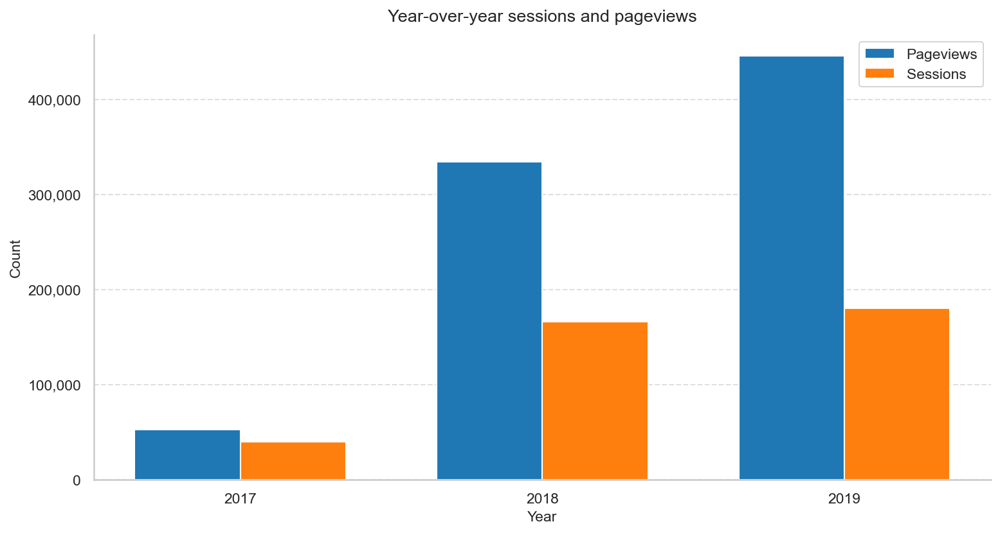

---

## Channel Performance

| Channel Grouping | Sessions | Pageviews | Bounces | Bounce Rate | Avg Time on Page (s) |
| --- | --- | --- | --- | --- | --- |
| Organic Search | 143,580 | 377,394 | 25,038 | 0.1744 | 28.6 |
| Direct | 116,646 | 198,996 | 27,853 | 0.2388 | 24.2 |
| Social | 61,557 | 93,232 | 14,814 | 0.2407 | 20.9 |
| Referral | 36,765 | 103,382 | 6,282 | 0.1709 | 30.5 |
| Paid Search | 25,074 | 54,350 | 5,044 | 0.2012 | 22.9 |
| Display | 2,289 | 5,348 | 520 | 0.2272 | 32.0 |
| (Other) | 12 | 8 | 4 | 0.3333 | 0.0000 |

Organic Search dominates both volume and consistency. Direct traffic is the second largest channel. Paid Search and Display represent a smaller but potentially higher-intent segment worth monitoring for efficiency.

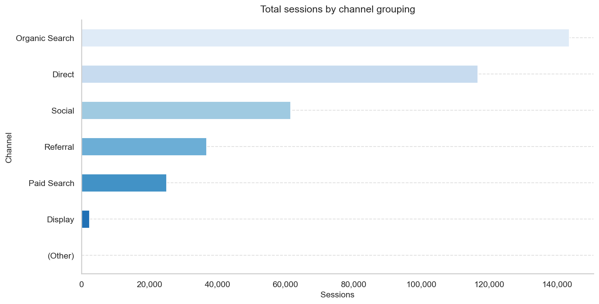

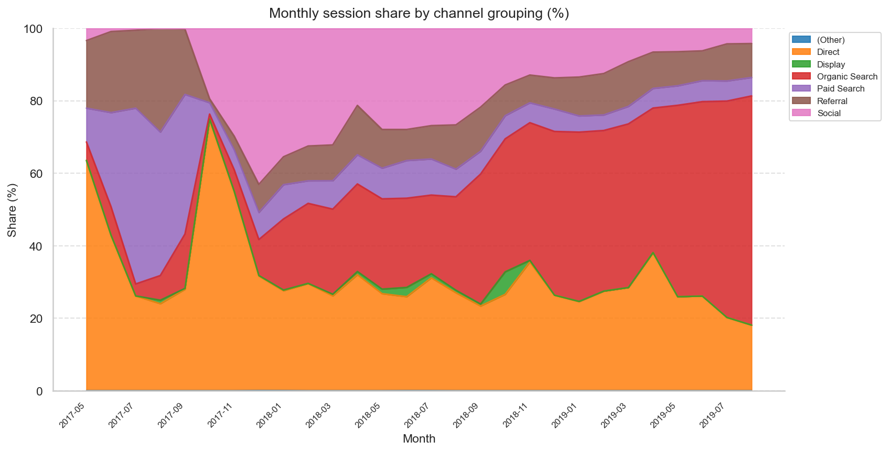

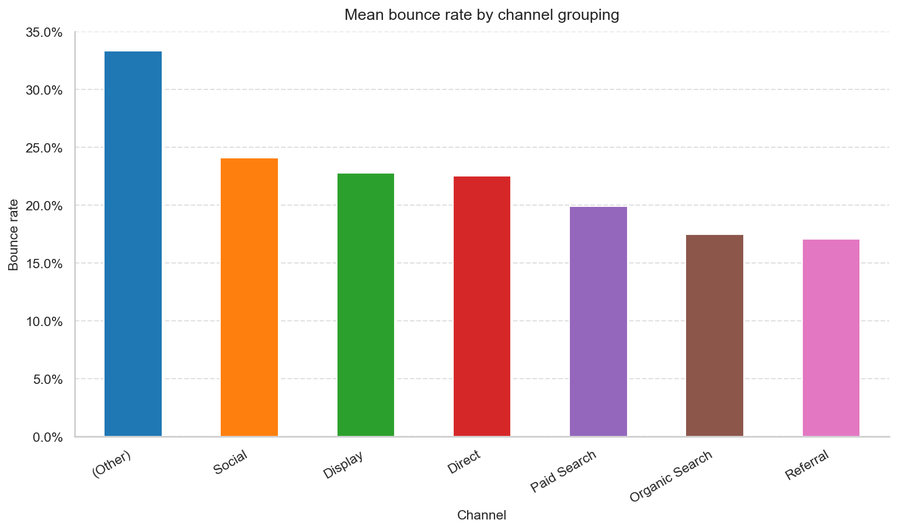

---

## Geographic Breakdown

| Country | Sessions | Pageviews | Desktop % | Mobile % | Tablet % |
| --- | --- | --- | --- | --- | --- |
| United States | 114,891 | 239,912 | nan | nan | nan |
| India | 46,740 | 103,486 | nan | nan | nan |
| France | 30,030 | 88,938 | nan | nan | nan |
| United Kingdom | 19,902 | 41,512 | nan | nan | nan |
| Germany | 13,554 | 27,058 | nan | nan | nan |
| Switzerland | 12,120 | 31,208 | nan | nan | nan |
| Australia | 9,609 | 16,966 | nan | nan | nan |
| Canada | 8,859 | 15,372 | nan | nan | nan |
| Spain | 8,514 | 13,636 | nan | nan | nan |
| Singapore | 7,260 | 14,288 | nan | nan | nan |

The United States is the largest single market. Notably, India and France rank second and third, indicating strong international reach.

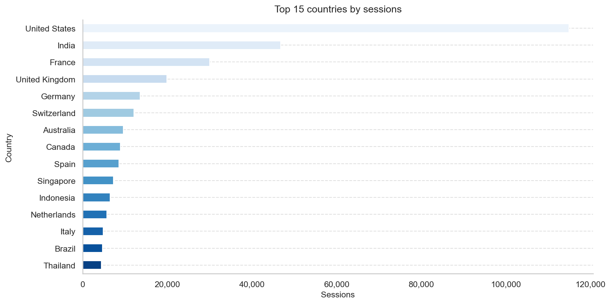

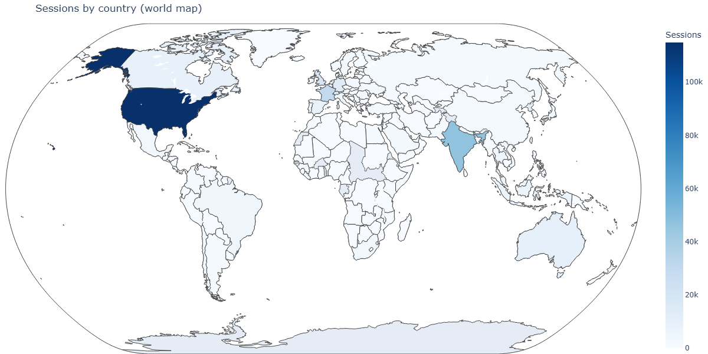

---

## Source / Medium

| Source Medium | Sessions | Pageviews | Bounces | Bounce Rate |
| --- | --- | --- | --- | --- |
| google.com.br / Referral | 138,090 | 145,474 | 23,975 | 0.1736 |
| indiegogo.com / Referral | 116,652 | 108,584 | 27,855 | 0.2388 |
| xrea.com / Referral | 30,021 | 23,888 | 7,592 | 0.2529 |
| amazon.co.jp / Referral | 27,453 | 26,810 | 5,593 | 0.2037 |
| cnet.com / Referral | 22,494 | 23,954 | 3,864 | 0.1718 |
| theguardian.com / Referral | 18,465 | 18,338 | 3,788 | 0.2051 |
| soundcloud.com / Referral | 5,598 | 4,146 | 1,673 | 0.2989 |
| fema.gov / Referral | 4,560 | 4,834 | 744 | 0.1632 |
| boston.com / Referral | 4,035 | 4,602 | 666 | 0.1651 |
| twitpic.com / Referral | 3,723 | 2,920 | 973 | 0.2613 |

> **Anomaly flag:** The top source/medium is `google.com.br / Referral` with 138,090 sessions. This volume is unusually high for a Brazilian Google referral and may indicate a GA tracking misconfiguration, spam/bot traffic, or a campaign tagging error. This should be investigated before attributing this traffic to genuine organic referrals.

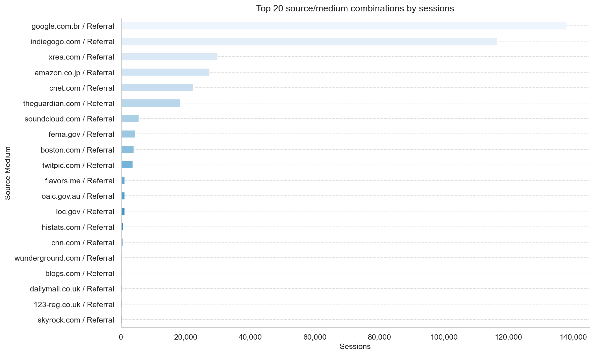

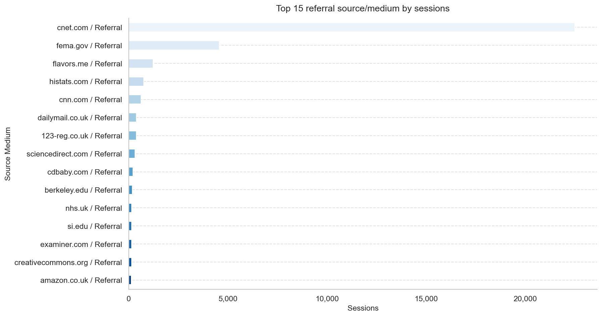

---

## Device Analysis

| Device Category | Sessions | Pageviews | Bounce Rate | Median Avg Page Load Time (ms) |
| --- | --- | --- | --- | --- |
| Desktop | 275,316 | 707,444 | 0.1806 | 0.0000 |
| Mobile | 98,934 | 101,018 | 0.2621 | 0.0000 |
| Tablet | 11,673 | 24,248 | 0.2083 | 0.0000 |

Desktop accounts for the majority of traffic. Mobile share is stable over the period. The relatively lower mobile bounce rate compared to some desktop channels may reflect differences in the visitor mix rather than true engagement differences.

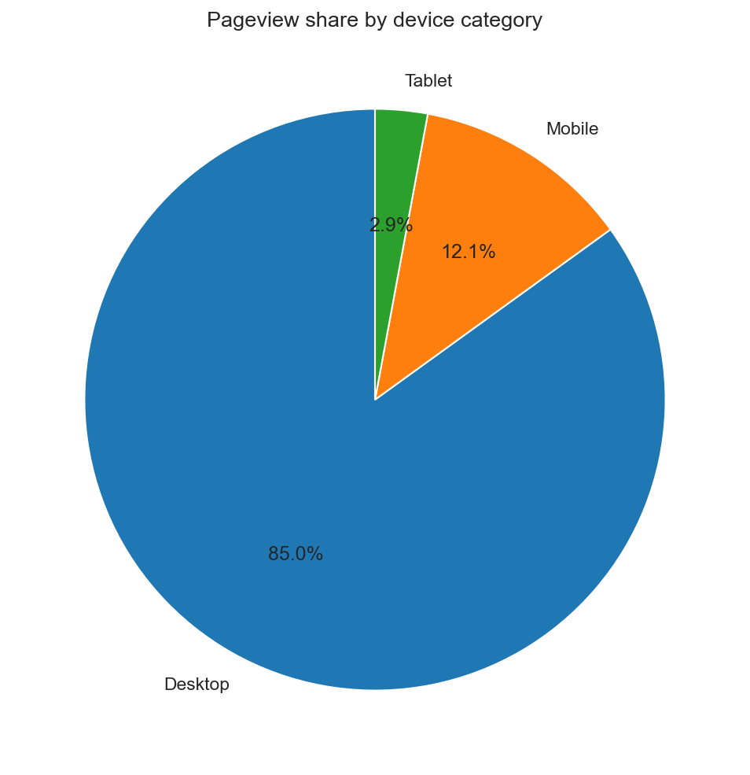

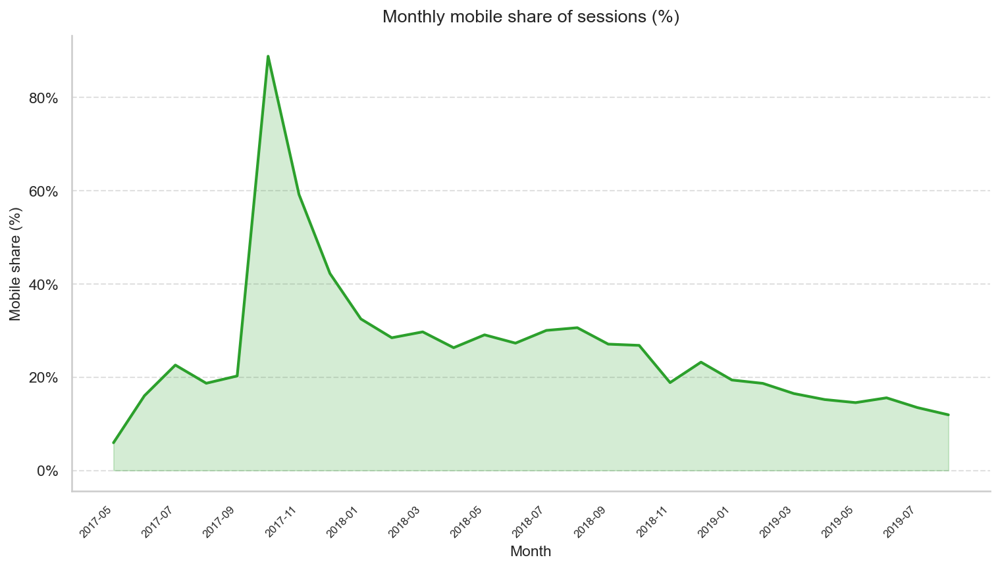

---

## Page Performance

| Page Title | Pageviews | Unique Pageviews | Exits | Exit Rate | Median Avg Page Load Time (ms) |
| --- | --- | --- | --- | --- | --- |
| Page Title 1783 | 44,820 | 20,486 | 2,598 | 0.0580 | 0.0000 |
| Page Title 460 | 44,032 | 19,324 | 2,336 | 0.0531 | 0.0000 |
| Page Title 496 | 42,694 | 32,954 | 10,350 | 0.2424 | 0.0000 |
| Page Title 1798 | 34,818 | 23,508 | 2,490 | 0.0715 | 0.0000 |
| Page Title 1827 | 32,568 | 24,254 | 5,894 | 0.1810 | 0.0000 |
| Page Title 11 | 21,322 | 13,870 | 3,228 | 0.1514 | 0.0000 |
| Page Title 477 | 18,138 | 13,566 | 1,460 | 0.0805 | 0.0000 |
| Page Title 1598 | 16,774 | 11,876 | 3,043 | 0.1814 | 0.0000 |
| Page Title 473 | 16,010 | 14,136 | 6,986 | 0.4364 | 0.0000 |
| Page Title 526 | 15,234 | 10,442 | 1,785 | 0.1172 | 0.0000 |

*Note: Page titles are anonymised IDs (e.g. 'Page Title 1783'). No content-level grouping is possible without a mapping file.*

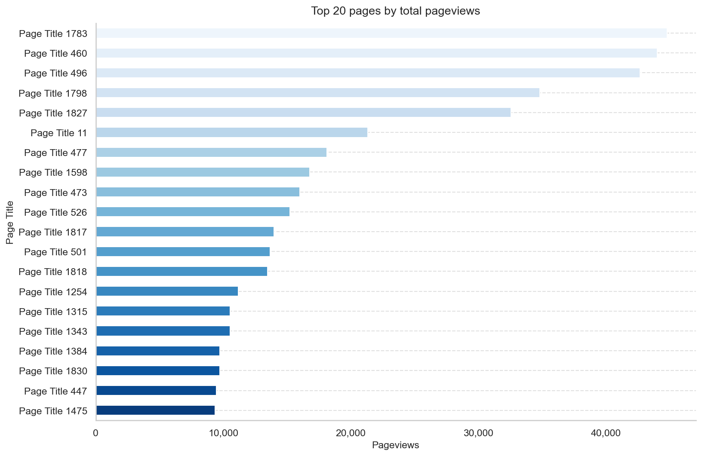

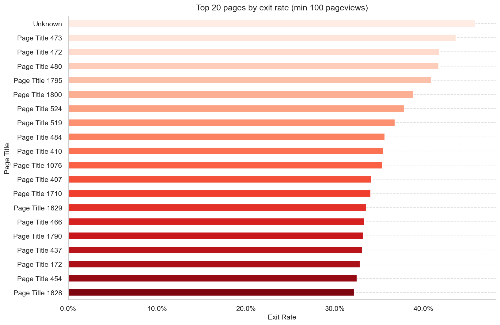

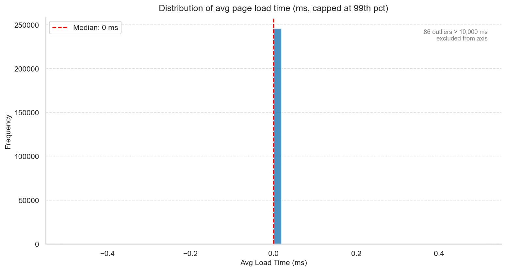

---

## Data Quality Notes

- **Encoding:** Non-standard UTF-16 LE with 2-byte non-BOM prefix -- requires custom loader.
- **Duplicates removed:** 10,807 fully duplicate rows dropped before any aggregation.
- **Dirty rows removed:** 18 rows where `Pageviews = 0` written to `dirty.csv` with reason `pageviews_zero`.
- **Sessions = 0 rows:** 141,017 rows retained for page-level metrics; excluded from session KPIs.
- **Page Load Time outliers:** 86 rows with `Avg Page Load Time > 10,000 ms` flagged and excluded from median calculations but retained in the dataset.

---

## Recommendations

1. **Investigate `google.com.br / Referral` traffic.** Its volume (138,090 sessions) is disproportionately large and may skew acquisition analytics. Apply a bot/spam filter or validate the GA tagging configuration before using these figures for decisions.
2. **Protect Organic Search investment.** With 37.2% of sessions, Organic Search is the backbone of acquisition. Monitor keyword rankings and ensure page load times remain competitive -- slow pages drive exits.
3. **Expand in top international markets.** United States leads, but India and France show strong volume. Consider localised content or campaigns to deepen penetration.
4. **Optimise for mobile.** Mobile is stable as a share of sessions. Audit the top pages by exit rate on mobile devices and prioritise load-time improvements.
5. **Review high-exit pages.** Pages with exit rates above 80% (see `plots/17`) may have content or UX issues. Cross-reference with time-on-page metrics to identify whether users are bouncing immediately or reading before leaving.
